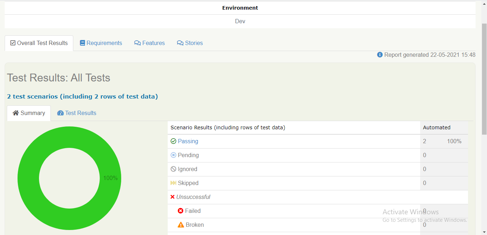

# Serenity-BDD
API Automation using Serenity BDD and JUnit
Serenity BDD is the most active framework available for both UI and API Automation.It's an open source library that aims to make the idea of living documentation a reality.

This Repo contains example of API automation test cases implemented with the help of JUnit and a local API with the functionality of creating a payment.

Sample Test cases available:
1. Test case to validate API Response Status Code and JSON Schema
2. Test case to validate the entire API Response details using Java models (de-serialization)

Below Screenshots shows the live reporting feature of Serenity BDD.

